# Beteiligungsorganigramm Familie Mustermann

```mermaid
graph TD

%% Natürliche Personen
    VATER["👤 Hans Mustermann\n(Vater)"]
    MUTTER["👤 Maria Mustermann\n(Mutter)"]
    SOHN1["👤 Thomas Mustermann\n(Sohn 1)"]
    SOHN2["👤 Klaus Mustermann\n(Sohn 2)"]

%% Holdinggesellschaften
    H1["🏢 Mustermann Holding GmbH"]
    H2["🏢 MM Beteiligungs GmbH"]
    H3["🏢 Familien Vermögens GmbH & Co. KG"]

%% Operative Gesellschaften – direkte Beteiligungen
    OP1["🏭 Mustermann Bau GmbH"]
    OP2["🏭 MM Immobilien GmbH"]
    OP3["🏭 Mustermann Logistik GmbH"]
    OP4["🏭 MM Digital Solutions GmbH"]
    OP5["🏭 Mustermann Hotel GmbH"]
    OP6["🏭 MM Handels GmbH"]
    OP7["🏭 Mustermann Energie GmbH"]
    OP8["🏭 MM Gastronomie GmbH"]
    OP9["🏭 Mustermann Finanz GmbH"]
    OP10["🏭 MM Grundstücks GmbH"]
    OP11["🏭 Mustermann Verwaltungs AG"]

%% Tochtergesellschaften
    T1["🏢 Bau Nord GmbH\n(Tochter)"]
    T2["🏢 Bau Süd GmbH\n(Tochter)"]
    T3["🏢 Immo Berlin GmbH\n(Tochter)"]
    T4["🏢 Immo München GmbH\n(Tochter)"]
    T5["🏢 Logistik West GmbH\n(Tochter)"]
    T6["🏢 Digital Austria GmbH\n(Tochter)"]
    T7["🏢 Hotel Bayern GmbH\n(Tochter)"]
    T8["🏢 Hotel Berlin GmbH\n(Tochter)"]

%% ── Beteiligungen der natürlichen Personen ──────────────────

    %% Mustermann Holding GmbH
    VATER  -->|"50 %"| H1
    MUTTER -->|"50 %"| H1

    %% MM Beteiligungs GmbH
    SOHN1  -->|"50 %"| H2
    SOHN2  -->|"50 %"| H2

    %% Familien Vermögens GmbH & Co. KG
    VATER  -->|"40 %"| H3
    MUTTER -->|"10 %"| H3
    SOHN1  -->|"25 %"| H3
    SOHN2  -->|"25 %"| H3

    %% Direktbeteiligungen Vater
    VATER  -->|"100 %"| OP9
    VATER  -->|"60 %"| OP11

    %% Direktbeteiligungen Mutter
    MUTTER -->|"100 %"| OP10

    %% Direktbeteiligungen Sohn 1
    SOHN1  -->|"100 %"| OP4

    %% Direktbeteiligungen Sohn 2
    SOHN2  -->|"100 %"| OP8

%% ── Beteiligungen der Holdinggesellschaften ─────────────────

    H1 -->|"100 %"| OP1
    H1 -->|"100 %"| OP2
    H1 -->|"60 %"| OP3

    H2 -->|"100 %"| OP5
    H2 -->|"100 %"| OP6

    H3 -->|"40 %"| OP3
    H3 -->|"100 %"| OP7

%% ── Tochtergesellschaften ───────────────────────────────────

    OP1 -->|"100 %"| T1
    OP1 -->|"100 %"| T2

    OP2 -->|"100 %"| T3
    OP2 -->|"51 %"| T4

    OP3 -->|"100 %"| T5

    OP4 -->|"100 %"| T6

    OP5 -->|"100 %"| T7
    OP5 -->|"75 %"| T8

%% ── Styling ─────────────────────────────────────────────────

    classDef person    fill:#4A90D9,stroke:#2C5F8A,color:#fff,font-weight:bold
    classDef holding   fill:#F5A623,stroke:#C47D0E,color:#fff,font-weight:bold
    classDef operative fill:#7ED321,stroke:#5A9A18,color:#fff
    classDef tochter   fill:#D0D0D0,stroke:#999,color:#333

    class VATER,MUTTER,SOHN1,SOHN2 person
    class H1,H2,H3 holding
    class OP1,OP2,OP3,OP4,OP5,OP6,OP7,OP8,OP9,OP10,OP11 operative
    class T1,T2,T3,T4,T5,T6,T7,T8 tochter
```

---

## Legende

| Farbe | Bedeutung |
|-------|-----------|
| 🔵 Blau | Natürliche Personen (Familie) |
| 🟠 Orange | Holdinggesellschaften |
| 🟢 Grün | Operative Gesellschaften (direkte Beteiligungen) |
| ⚪ Grau | Tochtergesellschaften |

## Gesellschaftsübersicht

| Nr. | Gesellschaft | Rechtsform | Anteilseigner |
|-----|-------------|------------|---------------|
| 1 | Mustermann Holding GmbH | GmbH | Vater 50 %, Mutter 50 % |
| 2 | MM Beteiligungs GmbH | GmbH | Sohn 1 50 %, Sohn 2 50 % |
| 3 | Familien Vermögens GmbH & Co. KG | GmbH & Co. KG | Vater 40 %, Mutter 10 %, Sohn 1 25 %, Sohn 2 25 % |
| 4 | Mustermann Bau GmbH | GmbH | Mustermann Holding 100 % |
| 5 | MM Immobilien GmbH | GmbH | Mustermann Holding 100 % |
| 6 | Mustermann Logistik GmbH | GmbH | Holding 60 %, Familien KG 40 % |
| 7 | MM Digital Solutions GmbH | GmbH | Sohn 1 100 % |
| 8 | Mustermann Hotel GmbH | GmbH | MM Beteiligungs 100 % |
| 9 | MM Handels GmbH | GmbH | MM Beteiligungs 100 % |
| 10 | Mustermann Energie GmbH | GmbH | Familien KG 100 % |
| 11 | MM Gastronomie GmbH | GmbH | Sohn 2 100 % |
| 12 | Mustermann Finanz GmbH | GmbH | Vater 100 % |
| 13 | MM Grundstücks GmbH | GmbH | Mutter 100 % |
| 14 | Mustermann Verwaltungs AG | AG | Vater 60 % |
